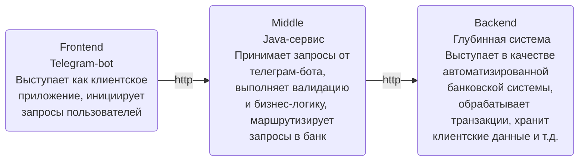

# sumkin-middle-service
Middle-service repo - the second part of the educational project, featuring major Tg API to emulate a bank-like service.

The service is intended to accept and validate Tg requests and rerout'em to further processing within the backend layer. 

See the diagram for details:

